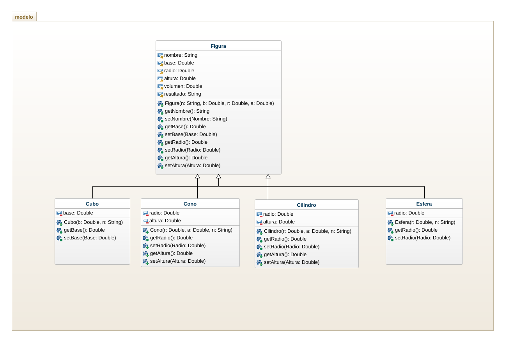
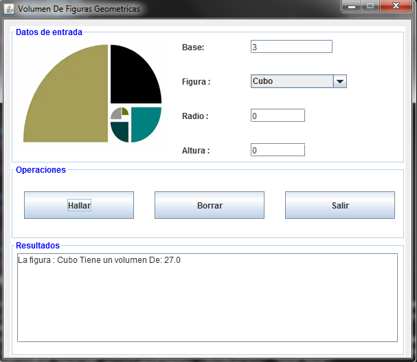
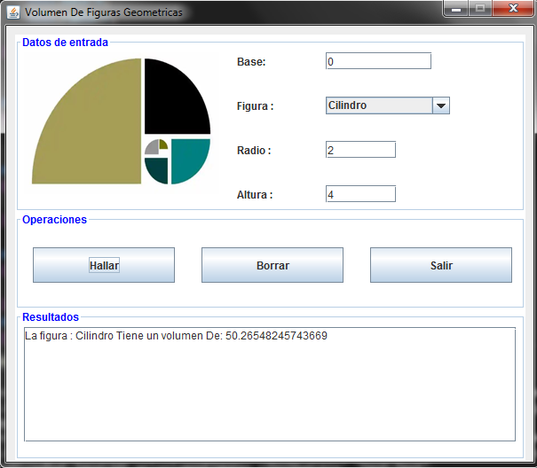
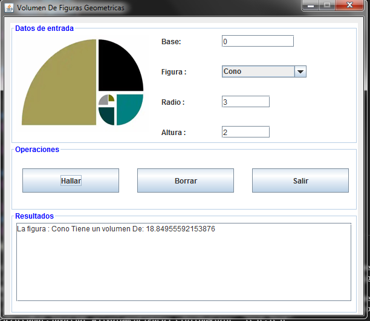
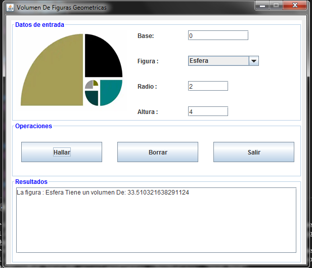

## 2do PARCIAL PRÁCTICO POO
Haciendo uso del patron de diseño MVC resuelva el siguiente problema,previa implementacion del diagrama de clases para el paquete modelo. El Diagrama de clases Junto pantallazos del programa en ejecucion deben ser incluidos en el README.MD del repositorio de GitHub en el que resolvio el problema.

- Elaborar un programa que ofrezca un menu de opciones mediante el cual se pueda escoger calcular el volumen de las figuras geometricas: cubo, cilindro, cono y esfera. Una vez seleccionada la opcion, que permita solicitar y leer el nombre de la figura y los datos necesarios para calcular el volumen correspondiente e imprmia el nombre de la figura y el volumen. Debe usarse una superclase Figura y una subclase para cada una de las figuras indicadas.

## DIAGRAMA DE CLASES

## PANTALLAZOS DE EJECUCION

